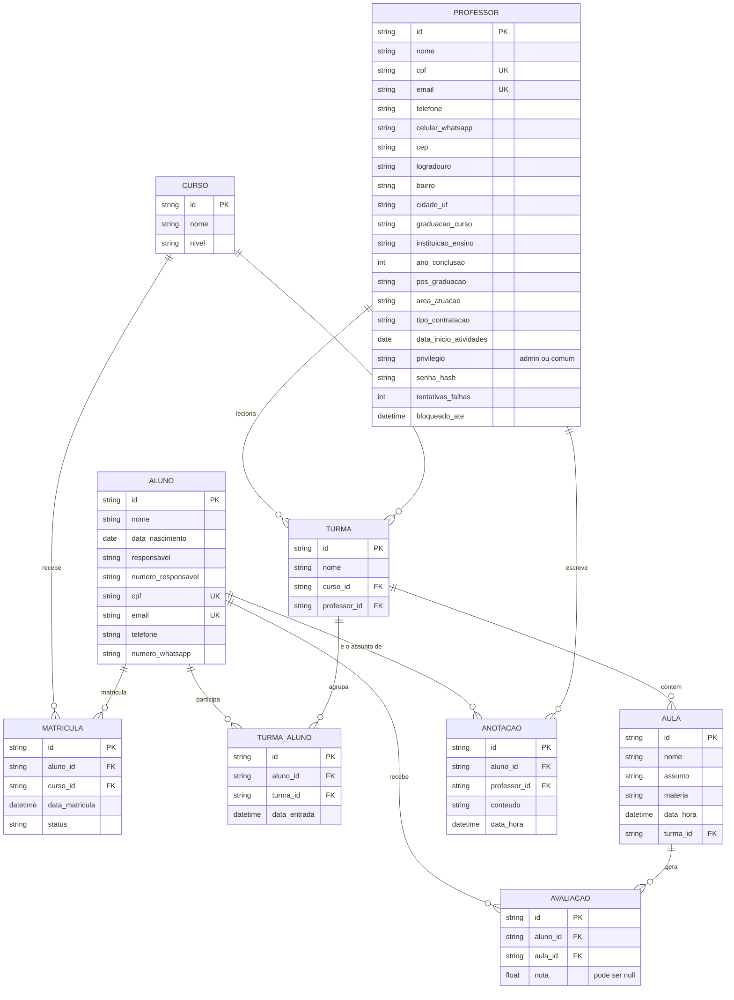

# UNIVESP PI2 Grupo 11

Sistema de gerenciamento de aulas de inglês para professores — um backend em Flask que controla professores, alunos, cursos, turmas, aulas, avaliações e anotações, com autenticação JWT e dois níveis de permissão (admin e comum).

## Sumário

- [Sobre o projeto](#sobre-o-projeto)
- [Tecnologias](#tecnologias)
- [Modelo de dados](#modelo-de-dados)
- [Autenticação e permissões](#autenticação-e-permissões)
- [Como rodar o projeto](#como-rodar-o-projeto)
- [Documentação da API](#documentação-da-api)
- [Endpoints](#endpoints)
- [Testes automatizados](#testes-automatizados)
- [Frontend](#frontend)
- [Variáveis de ambiente](#variáveis-de-ambiente)
- [Estrutura de pastas](#estrutura-de-pastas)

## Sobre o projeto

O sistema organiza o fluxo de uma escola de inglês:

- **Professores** administram o sistema — um professor com privilégio `admin` gerencia os demais professores; qualquer professor (`admin` ou `comum`) trabalha com alunos, cursos, turmas e aulas.
- **Cursos** funcionam como um catálogo (ex: "Inglês Básico"), sem professor fixo.
- **Turmas** são a seção de verdade: uma turma específica de um curso, com um professor e um grupo de alunos definidos.
- **Alunos** se matriculam num curso (`Matricula`) e são alocados numa turma (`TurmaAluno`).
- **Aulas** pertencem a uma turma, e cada aluno recebe uma **Avaliação** (nota) individual por aula.
- **Anotações** registram observações de um professor sobre um aluno, visíveis para qualquer professor que venha a assumir esse aluno depois.

## Tecnologias

- **Python 3.12**
- **Flask** + **APIFlask** (rotas com validação e documentação OpenAPI automática)
- **SQLAlchemy** + **Flask-SQLAlchemy** (ORM)
- **Flask-Migrate** (Alembic) — migrações de banco
- **Flask-JWT-Extended** — autenticação
- **PostgreSQL** — banco de dados
- **Docker** + **Docker Compose**
- **Pytest** — testes automatizados
- **Gunicorn** — servidor WSGI
- **Vue 3** + **Vite** — frontend
- **Pinia** — estado global no frontend
- **Vue Router** — navegação no frontend
- **Axios** — chamadas à API a partir do frontend

## Modelo de dados



## Autenticação e permissões

A API usa **JWT** (`Flask-JWT-Extended`). O login devolve um `access_token`, que deve ser enviado em toda requisição protegida no header:

```
Authorization: Bearer <token>
```

Existem dois níveis de professor:

- **admin** — acesso total.
- **comum** — pode ver (listar/obter) a maior parte dos recursos, mas só cria, edita e apaga o que está marcado como tal na tabela de endpoints abaixo.

Regras extras, além do nível de acesso:

- Um professor só vê o próprio perfil completo, a não ser que seja admin.
- Um admin não pode remover o próprio privilégio nem deletar a própria conta.
- Login bloqueia por 15 minutos após 5 tentativas de senha incorretas seguidas.

## Como rodar o projeto

Pré-requisitos: Docker e Docker Compose.

1. Copie o arquivo de exemplo de variáveis de ambiente e preencha os valores (veja a tabela completa em [Variáveis de ambiente](#variáveis-de-ambiente)):

   ```bash
   cp .env-examples .env
   ```

2. Suba os containers:

   ```bash
   docker compose up --build
   ```

   O banco Postgres sobe primeiro; quando fica saudável, o backend inicia. O `docker-entrypoint.sh` aplica as migrações pendentes (`flask db upgrade`) automaticamente antes de subir o servidor — não precisa rodar isso na mão.

3. Crie o primeiro professor (admin), usando o `ADMIN_USER`/`ADMIN_PASS` definidos no `.env`:

   ```bash
   docker compose exec backend flask seed-admin
   ```

4. A API está em `http://localhost:5000`. Faça login em `POST /auth/login` com o email/senha do admin criado, e use o `access_token` retornado nas próximas chamadas.

5. O frontend está em `http://localhost:5173` e já chama a API sozinho — faça login pela própria tela.

### Criando uma nova migração

Sempre que um model for alterado:

```bash
docker compose exec backend flask db migrate -m "descricao da mudanca"
docker compose exec backend flask db upgrade
```

Revise o arquivo gerado em `backend/migrations/versions/` antes de aplicar.

## Documentação da API

Com o projeto no ar, a documentação interativa (Swagger UI) fica disponível em:

```
http://localhost:5000/docs
```

Gerada automaticamente pelo APIFlask a partir dos schemas de cada rota — dá pra testar as chamadas direto pelo navegador.

## Endpoints

Todas as rotas de negócio exigem um token válido (`401` sem ele). A coluna **Acesso** mostra quem, além de estar logado, pode chamar cada uma.

| Recurso | Método | Rota | Acesso |
| --- | --- | --- | --- |
| Auth | POST | `/auth/login` | Público |
| Professor | GET | `/professores/` | Admin |
| Professor | GET | `/professores/<id>` | Próprio perfil ou admin |
| Professor | POST | `/professores/` | Admin |
| Professor | PUT | `/professores/<id>` | Próprio perfil ou admin |
| Professor | DELETE | `/professores/<id>` | Admin |
| Aluno | GET | `/alunos/`, `/alunos/<id>` | Qualquer professor |
| Aluno | POST, PUT, DELETE | `/alunos/...` | Admin |
| Curso | GET | `/cursos/`, `/cursos/<id>` | Qualquer professor |
| Curso | POST, PUT, DELETE | `/cursos/...` | Admin |
| Matrícula | GET, POST, PUT, DELETE | `/matriculas/...` | Admin |
| Turma | GET | `/turmas/`, `/turmas/<id>` | Qualquer professor |
| Turma | POST, PUT, DELETE | `/turmas/...` | Admin |
| Turma-Aluno | GET | `/turma-alunos/`, `/turma-alunos/<id>` | Qualquer professor |
| Turma-Aluno | POST, DELETE | `/turma-alunos/...` | Admin |
| Aula | GET | `/aulas/`, `/aulas/<id>` | Qualquer professor |
| Aula | POST, PUT, DELETE | `/aulas/...` | Admin |
| Avaliação | GET, POST, PUT | `/avaliacoes/...` | Qualquer professor |
| Avaliação | DELETE | `/avaliacoes/<id>` | Admin |
| Anotação | GET, POST, PUT | `/anotacoes/...` | Qualquer professor |
| Anotação | DELETE | `/anotacoes/<id>` | Admin |

## Testes automatizados

```bash
docker compose exec backend pytest -v
```

Os testes rodam contra um banco SQLite em memória (configurado em `TestConfig`, em `config.py`), isolado do Postgres de desenvolvimento — não precisa de nenhum setup extra.

## Frontend

Existe uma primeira versão do frontend em Vue — feita como ponto de partida para a equipe de front assumir dali pra frente, não como produto pronto.

### Stack

- **Vue 3** (Composition API, `<script setup>`)
- **Vite** — build e dev server
- **Vue Router** — navegação entre telas
- **Pinia** — estado global (sessão do professor logado)
- **Axios** — chamadas para a API

### O que já existe

- Tela de login + apresentação (`LoginView.vue`), com a paleta de cores do projeto e responsiva (funciona como webapp em celular).
- Uma `DashboardView.vue` de placeholder, só para confirmar que o login funciona de ponta a ponta — a tela de verdade ainda não foi construída.
- Guarda de rota (`router/index.js`): páginas com `meta: { requiresAuth: true }` redirecionam para o login se não houver token.
- Store de autenticação (`stores/auth.js`): guarda o `access_token` (hoje em `localStorage`) e expõe `login()` / `logout()` / `isAuthenticated()`.
- Serviço de API (`services/api.js`): instância do Axios já configurada com a URL da API e o header `Authorization` injetado automaticamente em toda requisição.

### Paleta de cores

Inspirada na arte que a escola usa, definida como variáveis CSS em `frontend/src/assets/main.css`:

| Variável | Cor | Uso |
| --- | --- | --- |
| `--color-primary` | `#0A1F44` | Header, fundo de destaque, textos de marca |
| `--color-accent` | `#C8102E` | Botões de ação, links ativos |
| `--color-background` | `#F7F8FA` | Fundo das páginas |
| `--color-surface` | `#FFFFFF` | Cartões, formulários |
| `--color-text` | `#1F2937` | Texto principal |
| `--color-text-secondary` | `#6B7280` | Texto secundário, labels |
| `--color-border` | `#E2E5EA` | Bordas e divisórias |
| `--color-success` | `#2E7D32` | Confirmações |
| `--color-error` | `#DC2626` | Erros e alertas |

### Estrutura

```
frontend/src/
├── main.js               # ponto de entrada — importa main.css, Pinia e Router
├── App.vue                # só renderiza a rota atual
├── assets/main.css        # variáveis de cor e estilos globais
├── router/index.js        # rotas e guarda de autenticação
├── stores/auth.js         # sessão do professor logado (Pinia)
├── services/api.js        # instância do Axios
└── views/
    ├── LoginView.vue       # login + apresentação
    └── DashboardView.vue   # placeholder pós-login
```

### O que falta (para a equipe de frontend)

- Telas de CRUD para Professor, Aluno, Curso, Turma, Aula, Avaliação e Anotação, seguindo os endpoints documentados em [Endpoints](#endpoints).
- Esconder/mostrar itens de navegação de acordo com o `privilegio` do professor logado (o backend já aplica a regra de permissão; o frontend só precisa refletir isso na interface).
- Tratar a expiração do token — hoje, se o token expirar, a próxima chamada à API simplesmente falha com `401`; falta redirecionar para o login automaticamente nesse caso.

## Variáveis de ambiente

Definidas no `.env` (não versionado — copie de `.env-examples`):

| Variável | Descrição |
| --- | --- |
| `DB_USER` | Usuário do Postgres |
| `DB_PASSWORD` | Senha do Postgres |
| `DB_NAME` | Nome do banco |
| `DATABASE_URL` | String de conexão completa usada pelo Flask |
| `JWT_SECRET_KEY` | Chave usada para assinar os tokens JWT — troque por um valor próprio e secreto |
| `ADMIN_USER` | Email do primeiro professor admin, usado pelo `flask seed-admin` |
| `ADMIN_PASS` | Senha do primeiro professor admin, usado pelo `flask seed-admin` |
| `VITE_API_URL` | URL da API usada pelo frontend (Axios) — em desenvolvimento local, `http://localhost:5000` |

## Estrutura de pastas

```
.
├── docker-compose.yml
├── .env-examples
│
├── frontend/
│   ├── Dockerfile
│   ├── index.html
│   ├── package.json
│   ├── vite.config.js
│   └── src/
│       ├── main.js
│       ├── App.vue
│       ├── assets/main.css
│       ├── router/index.js
│       ├── stores/auth.js
│       ├── services/api.js
│       └── views/
│           ├── LoginView.vue
│           └── DashboardView.vue
│
└── backend/
    ├── app.py                  # application factory
    ├── config.py               # configuração (produção e testes)
    ├── Dockerfile
    ├── docker-entrypoint.sh
    ├── requirements.txt
    ├── pyproject.toml
    │
    ├── models/                 # models do SQLAlchemy
    │   ├── __init__.py
    │   ├── professor.py
    │   ├── aluno.py
    │   ├── curso.py
    │   ├── matricula.py
    │   ├── turma.py            # Turma e TurmaAluno
    │   ├── aula.py              # Aula e Avaliacao
    │   └── anotacao.py
    │
    ├── schemas/                # validação e serialização (APIFlask)
    │   ├── auth.py
    │   ├── professor.py
    │   ├── aluno.py
    │   ├── curso.py
    │   ├── matricula.py
    │   ├── turma.py
    │   └── aula.py
    │
    ├── routes/                 # blueprints de cada recurso
    │   ├── __init__.py
    │   ├── auth_routes.py
    │   ├── professor_routes.py
    │   ├── aluno_routes.py
    │   ├── curso_routes.py
    │   ├── matricula_routes.py
    │   ├── turma_routes.py
    │   ├── turma_aluno_routes.py
    │   ├── aula_routes.py
    │   ├── avaliacao_routes.py
    │   └── anotacao_routes.py
    │
    ├── services/
    │   ├── database.py          # instâncias do SQLAlchemy e do Migrate
    │   ├── auth.py               # decorators admin_required / self_or_admin_required
    │   └── admin.py              # cria o primeiro professor admin (flask seed-admin)
    │
    ├── migrations/
    │   └── versions/             # migrações geradas pelo Alembic
    │
    └── tests/
        ├── conftest.py           # fixtures (app, client, admin, comum, tokens)
        ├── test_auth.py
        ├── test_professor.py
        ├── test_aluno.py
        ├── test_curso.py
        ├── test_matricula.py
        ├── test_turma.py
        ├── test_turma_aluno.py
        ├── test_aula.py
        ├── test_avaliacao.py
        └── test_anotacao.py
```
